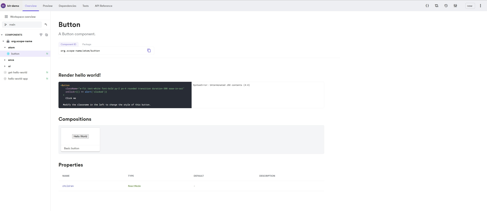

## Bit Demo

## TechStack

- [x] bit
- [x] tailwind



```javascript

$ npx @teambit/bvm install

$ bit new hello-world bit-demo --env teambit.community/starters/hello-world

Congrats! A new workspace has been created successfully at '/home/jchen/dev/bit/bit-demo'

Inside the directory 'bit-demo' you can run various commands including:

      bit start
        Starts the workspace in development mode

      bit install
        Installs any missing dependencies

      bit status
        Shows the status of the components

      bit compile
        Compiles the components

      bit test
        Runs the tests on all your components

      bit templates
        Shows all available component templates

      bit help
        Shows all available commands

# Lets get started!

      cd bit-demo
      bit run hello-world-app
      bit start

# tailwind
$ bit install @learnbit/styling.transformers.tailwind

$ bit install @learnbit/styling.config.tailwind

```

Start bit.bit:

```js
bit run bit-dev
```
